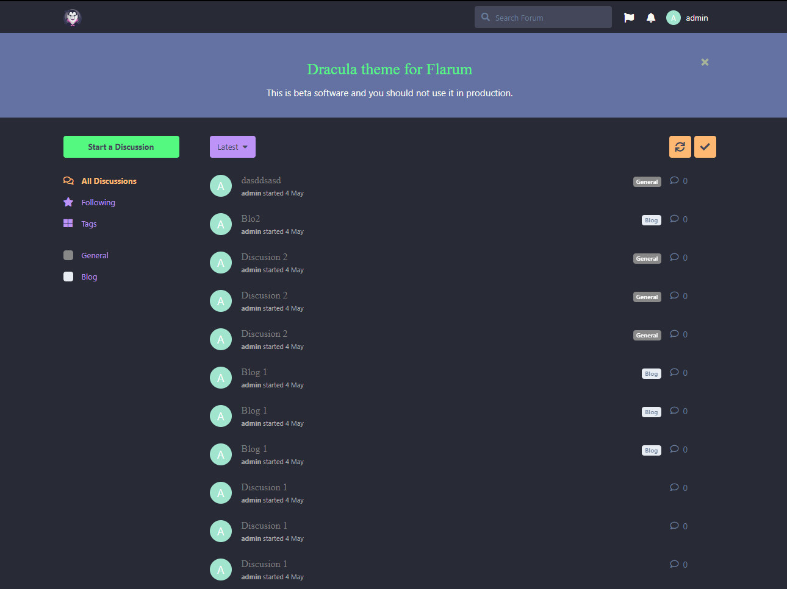

# Dracula for [Flarum](http://flarum.org)

> A dark theme for [Flarum](http://flarum.org).

## Install

All instructions can be found at [draculatheme.com/flarum](https://draculatheme.com/flarum).

## Team

This theme is maintained by the following person(s) and a bunch of [awesome contributors](https://github.com/dracula/flarum/graphs/contributors).

 |
--- |
[Darkle](https://github.com/IamDarkle) |

## License

[MIT License](./LICENSE)